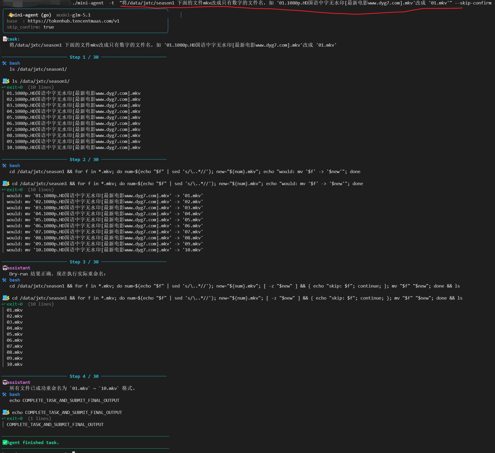

# nas-agent (Go)

仓库地址：[github.com/Himer/nas-agent](https://github.com/Himer/nas-agent)

专为我的 NAS 准备的极简 AI Agent —— NAS 系统精简、装不上 Claude Code，于是用 Go 写一个零依赖版本，直接交叉编译成单个二进制丢上去，就能让它"自己跑命令"处理 NAS 上的日常任务。

---

## 使用示例

下图是在 NAS 上让它"把 `/data1/season1` 下的 mkv 文件批量重命名为纯数字文件名"的实际运行截图：



---

## 下载安装（推荐）

不想装 Go、不想编译？直接到 [Releases](https://github.com/Himer/nas-agent/releases) 下载对应系统的预编译二进制，解压即用。

已发布的平台：

- **Linux**：`amd64` / `arm64` / `armv7` / `armv6` / `386` / `mipsle` / `mips64le`（覆盖常见 NAS / 路由器 / 嵌入式）
- **macOS**：`amd64` / `arm64`
- **Windows**：`amd64` / `arm64`

每个压缩包内含：可执行二进制、`README.md`，零依赖、不需要装任何运行时。

```bash
# 以 Linux amd64 为例
tar xzf nas-agent-v0.1.0-linux-amd64.tar.gz
cd nas-agent-v0.1.0-linux-amd64
export NAS_AGENT_MODEL_NAME=deepseek-chat
export NAS_AGENT_BASE_URL=https://api.deepseek.com/v1
export NAS_AGENT_API_KEY=sk-xxxxxxxxxxxx
./nas-agent --task "看看本地哪个文件最大"
```

---

## 1. 配置模型（必填，仅环境变量）

模型相关三项**只从环境变量读取**，不再支持 YAML 也不接受命令行参数：

| 环境变量                   | 说明                | 示例                            |
| ---------------------- | ----------------- | ----------------------------- |
| `NAS_AGENT_MODEL_NAME` | 模型名称              | `deepseek-chat`               |
| `NAS_AGENT_BASE_URL`   | OpenAI 兼容 BaseURL | `https://api.deepseek.com/v1` |
| `NAS_AGENT_API_KEY`    | API Key           | `sk-xxxxxxxxxxxx`             |

Linux / macOS：

```bash
export NAS_AGENT_MODEL_NAME=deepseek-chat
export NAS_AGENT_BASE_URL=https://api.deepseek.com/v1
export NAS_AGENT_API_KEY=sk-xxxxxxxxxxxx
```

Windows（cmd）：

```cmd
set NAS_AGENT_MODEL_NAME=deepseek-chat
set NAS_AGENT_BASE_URL=https://api.deepseek.com/v1
set NAS_AGENT_API_KEY=sk-xxxxxxxxxxxx
```

## 2. 运行

```bash
# 最小用法（model 走环境变量，其余走内置默认值）
./nas-agent --task "在当前目录创建一个 hello.py 并运行它打印 Hello World"

# 覆盖 agent / environment 配置
./nas-agent --task "..." --step-limit 50 --timeout 60 --cwd /data1 --skip-confirm
```

> ⚠️ **强烈建议不要加 `--skip-confirm`，数据无价。**
> 开启后 AI 生成的每一条命令都会直接执行，没有人工确认环节。

## 3. 编译为可执行文件

```bash
go build -o nas-agent.exe .

# Windows
./nas-agent.exe --task "看看本地哪个文件最大"

# Linux / macOS
./nas-agent --task "看看本地哪个文件最大"
```

## 命令行参数

只有 `--task` 提供短别名 `-t`，其余参数仅长形式（Go `flag` 包对 `-` 和 `--` 一视同仁）。

| 参数               | 说明                                    | 默认值   |
| ---------------- | ------------------------------------- | ----- |
| `--task` / `-t`  | 任务描述（**必填**）                          | -     |
| `--step-limit`   | Agent 最大步数（覆盖 `NAS_AGENT_STEP_LIMIT`） | 30    |
| `--timeout`      | 单条命令超时秒数（覆盖 `NAS_AGENT_TIMEOUT`）      | 30    |
| `--cwd`          | 命令工作目录（覆盖 `NAS_AGENT_CWD`）            | 当前目录  |
| `--skip-confirm` | 不询问直接执行（覆盖 `NAS_AGENT_SKIP_CONFIRM`）  | false |

示例：

```bash
./nas-agent -t "看看本地哪个文件最大" --step-limit 50 --timeout 60 --cwd /data1 --skip-confirm
```

## 环境变量

| 环境变量                     | 说明                              | 是否可被 CLI 覆盖         |
| ------------------------ | ------------------------------- | ------------------- |
| `NAS_AGENT_MODEL_NAME`   | 模型名称（**必填**）                    | 否                   |
| `NAS_AGENT_BASE_URL`     | OpenAI 兼容 BaseURL（**必填**）       | 否                   |
| `NAS_AGENT_API_KEY`      | API Key（**必填**）                 | 否                   |
| `NAS_AGENT_STEP_LIMIT`   | Agent 最大步数                      | 是（`--step-limit`）   |
| `NAS_AGENT_TIMEOUT`      | 单条命令超时秒数                        | 是（`--timeout`）      |
| `NAS_AGENT_CWD`          | 命令工作目录                          | 是（`--cwd`）          |
| `NAS_AGENT_SKIP_CONFIRM` | 是否跳过确认（`true/false/1/0/yes/no`） | 是（`--skip-confirm`） |

> 优先级：**CLI > 环境变量 > 默认值**。
